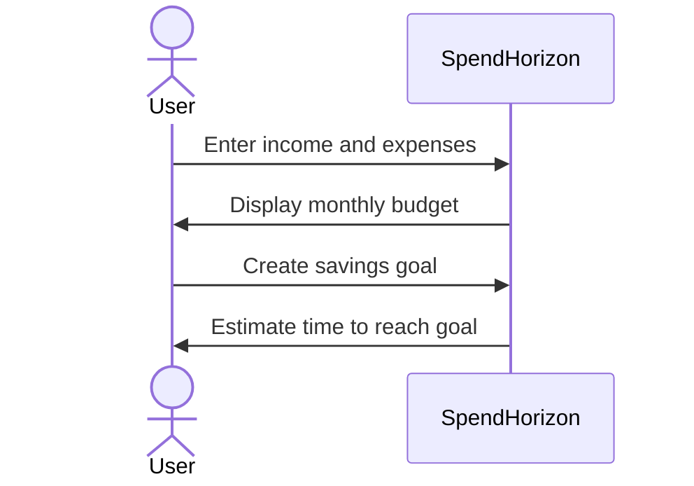

# Spend Horizon

[My Notes](notes.md)

Spend Horizon is a budgeting app that helps users track their income, expenses, and savings. Users can see where their money is going, set goals for future purchases, and find out how long it will take to afford them. The app will also provide suggestions for saving money and use graphs to show spending and saving progress over time.

> [!NOTE]
> This is a template for your startup application. You must modify this `README.md` file for each phase of your development. You only need to fill in the section for each deliverable when that deliverable is submitted in Canvas. Without completing the section for a deliverable, the TA will not know what to look for when grading your submission. Feel free to add additional information to each deliverable description, but make sure you at least have the list of rubric items and a description of what you did for each item.

> [!NOTE]
> If you are not familiar with Markdown then you should review the [documentation](https://docs.github.com/en/get-started/writing-on-github/getting-started-with-writing-and-formatting-on-github/basic-writing-and-formatting-syntax) before continuing.

### Elevator pitch

Spend Horizon is a budgeting app that helps you plan for what’s next, not just track what you’ve already spent. Enter your income and monthly expenses to see where your money is going, track your progress over time, and plan for future purchases. Whether you’re saving for a car, a trip, or something else, Spend Horizon estimates how long it will take to reach your goal and helps you find ways to get there faster.

### Design

#### Dashboard

#### Budget Page

#### Savings Goals Page

### Key features

- Track monthly income and expenses.
- Categorize expenses such as rent, food, bills, and entertainment.
- Create savings goals for future purchases.
- Calculate how long it will take to reach a savings goal based on the user's current budget.
- Suggest areas where the user could spend less to reach their goals faster.
- View graphs that show spending and saving progress over time.

### Technologies

I am going to use the required technologies in the following ways.

- **HTML** - Provide the structure for pages such as the dashboard, budget, savings goals, and login page.

- **CSS** - Style the website, graphs, buttons, savings progress bars, and page layouts. CSS will also make the website responsive to different screen sizes.

- **React** - Create reusable components for expenses, savings goals, graphs, and other parts of the website. React will also handle navigation between pages and update displayed information when the user changes their budget.

- **Service** - Provide backend endpoints for creating accounts, logging in,
  managing expenses, and managing savings goals. The service will also use the
  [Frankfurter API](https://frankfurter.dev/) to get current currency exchange
  rates for savings goals involving other currencies.

- **DB/Login** - Store user account information along with each user's income, expenses, savings goals, and financial history.

- **WebSocket** - Send real-time notifications to users, such as notifying them when they reach a savings milestone.

## 🚀 Specification Deliverable

> [!NOTE]
> Fill in this sections as the submission artifact for this deliverable. You can refer to this [example](https://github.com/webprogramming260/startup-example/blob/main/README.md) for inspiration.

For this deliverable I did the following. I checked the box `[x]` and added a description for things I completed.

- [x] I completed the prerequisites for this deliverable (Git commit requirement) - I made multiple Git commits while completing the specification.

- [x] Proper use of Markdown - I used headings, lists, links, images, and a Mermaid diagram to organize and present the README.

- [x] A concise and compelling elevator pitch - I created an elevator pitch explaining how Spend Horizon helps users track their budget and plan for future purchases.

- [x] Description of key features - I described features including expense tracking, savings goals, savings suggestions, and graphs showing financial progress.

- [x] Description of how you will use each technology including your 3rd party API and use of WebSocket - I described how HTML, CSS, React, backend services, a database, and WebSocket will be used. I also included the Frankfurter API for currency exchange rates.

- [x] One or more rough sketches of your application. Images must be embedded in this file using Markdown image references. - I created and embedded sketches for the dashboard, budget page, and savings goals page.

## 🚀 AWS deliverable

For this deliverable I did the following. I checked the box `[x]` and added a description for things I completed.

- [ ] **Rented EC2 server** - I did not complete this part of the deliverable.
- [ ] **Leased domain name** - I did not complete this part of the deliverable.
- [ ] **Server accessible** from my domain: [https://yourdomainnamehere.click](https://yourdomainnamehere.click) - I did not complete this part of the deliverable.

## 🚀 HTML deliverable

For this deliverable I did the following. I checked the box `[x]` and added a description for things I completed.

- [ ] I completed the prerequisites for this deliverable (Simon deployed, GitHub link, Git commits)
- [ ] **HTML pages** - I did not complete this part of the deliverable.
- [ ] **Proper HTML element usage** - I did not complete this part of the deliverable.
- [ ] **Links** - I did not complete this part of the deliverable.
- [ ] **Text** - I did not complete this part of the deliverable.
- [ ] **3rd party API placeholder** - I did not complete this part of the deliverable.
- [ ] **Images** - I did not complete this part of the deliverable.
- [ ] **Login placeholder** - I did not complete this part of the deliverable.
- [ ] **DB data placeholder** - I did not complete this part of the deliverable.
- [ ] **WebSocket placeholder** - I did not complete this part of the deliverable.

## 🚀 CSS deliverable

For this deliverable I did the following. I checked the box `[x]` and added a description for things I completed.

- [ ] I completed the prerequisites for this deliverable (Simon deployed, GitHub link, Git commits)
- [ ] **Visually appealing colors and layout. No overflowing elements.** - I did not complete this part of the deliverable.
- [ ] **Use of a CSS framework** - I did not complete this part of the deliverable.
- [ ] **All visual elements styled using CSS** - I did not complete this part of the deliverable.
- [ ] **Responsive to window resizing using flexbox and/or grid display** - I did not complete this part of the deliverable.
- [ ] **Use of a imported font** - I did not complete this part of the deliverable.
- [ ] **Use of different types of selectors including element, class, ID, and pseudo selectors** - I did not complete this part of the deliverable.

## 🚀 React part 1: Routing deliverable

For this deliverable I did the following. I checked the box `[x]` and added a description for things I completed.

- [ ] I completed the prerequisites for this deliverable (Simon deployed, GitHub link, Git commits)
- [ ] **Bundled using Vite** - I did not complete this part of the deliverable.
- [ ] **Components** - I did not complete this part of the deliverable.
- [ ] **Router** - I did not complete this part of the deliverable.

## 🚀 React part 2: Reactivity deliverable

For this deliverable I did the following. I checked the box `[x]` and added a description for things I completed.

- [ ] I completed the prerequisites for this deliverable (Simon deployed, GitHub link, Git commits)
- [ ] **All functionality implemented or mocked out** - I did not complete this part of the deliverable.
- [ ] **Hooks** - I did not complete this part of the deliverable.

## 🚀 Service deliverable

For this deliverable I did the following. I checked the box `[x]` and added a description for things I completed.

- [ ] I completed the prerequisites for this deliverable (Simon deployed, GitHub link, Git commits)
- [ ] **Node.js/Express HTTP service** - I did not complete this part of the deliverable.
- [ ] **Static middleware for frontend** - I did not complete this part of the deliverable.
- [ ] **Calls to third party endpoints** - I did not complete this part of the deliverable.
- [ ] **Backend service endpoints** - I did not complete this part of the deliverable.
- [ ] **Frontend calls service endpoints** - I did not complete this part of the deliverable.
- [ ] **Supports registration, login, logout, and restricted endpoint** - I did not complete this part of the deliverable.
- [ ] **Uses BCrypt to hash passwords** - I did not complete this part of the deliverable.

## 🚀 DB deliverable

For this deliverable I did the following. I checked the box `[x]` and added a description for things I completed.

- [ ] I completed the prerequisites for this deliverable (Simon deployed, GitHub link, Git commits)
- [ ] **Stores data in MongoDB** - I did not complete this part of the deliverable.
- [ ] **Stores credentials in MongoDB** - I did not complete this part of the deliverable.

## 🚀 WebSocket deliverable

For this deliverable I did the following. I checked the box `[x]` and added a description for things I completed.

- [ ] I completed the prerequisites for this deliverable (Simon deployed, GitHub link, Git commits)
- [ ] **Backend listens for WebSocket connection** - I did not complete this part of the deliverable.
- [ ] **Frontend makes WebSocket connection** - I did not complete this part of the deliverable.
- [ ] **Data sent over WebSocket connection** - I did not complete this part of the deliverable.
- [ ] **WebSocket data displayed** - I did not complete this part of the deliverable.
- [ ] **Application is fully functional** - I did not complete this part of the deliverable.
