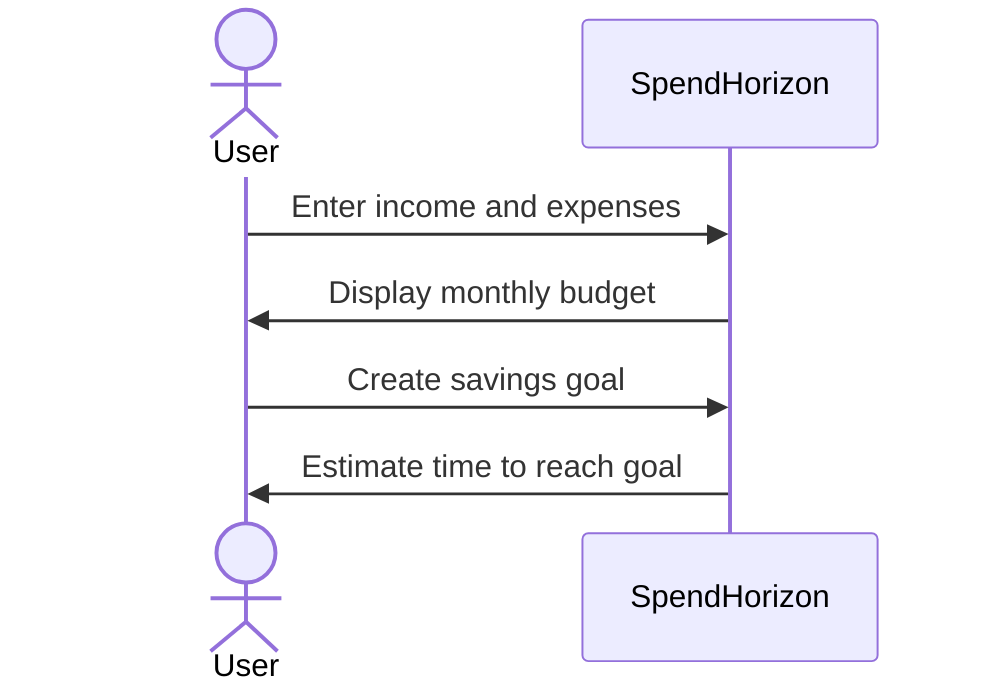

# Spend Horizon

[My Notes](notes.md)

Spend Horizon is a budgeting app that helps users track their income, expenses, and savings. Users can see where their money is going, set goals for future purchases, and find out how long it will take to afford them. The app will also provide suggestions for saving money and use graphs to show spending and saving progress over time.

> [!NOTE]
> This is a template for your startup application. You must modify this `README.md` file for each phase of your development. You only need to fill in the section for each deliverable when that deliverable is submitted in Canvas. Without completing the section for a deliverable, the TA will not know what to look for when grading your submission. Feel free to add additional information to each deliverable description, but make sure you at least have the list of rubric items and a description of what you did for each item.

> [!NOTE]
> If you are not familiar with Markdown then you should review the [documentation](https://docs.github.com/en/get-started/writing-on-github/getting-started-with-writing-and-formatting-on-github/basic-writing-and-formatting-syntax) before continuing.

### Elevator pitch

Spend Horizon is a budgeting app that helps you plan for what’s next, not just track what you’ve already spent. Enter your income and monthly expenses to see where your money is going, track your progress over time, and plan for future purchases. Whether you’re saving for a car, a trip, or something else, Spend Horizon estimates how long it will take to reach your goal and helps you find ways to get there faster.

### Design

#### Dashboard

#### Budget Page

#### Savings Goals Page

```mermaid
sequenceDiagram
    actor User
    participant SpendHorizon

    User->>SpendHorizon: Enter income and expenses
    SpendHorizon->>User: Display monthly budget
    User->>SpendHorizon: Create savings goal
    SpendHorizon->>User: Estimate time to reach goal
```

### Key features

- Track monthly income and expenses.
- Categorize expenses such as rent, food, bills, and entertainment.
- Create savings goals for future purchases.
- Calculate how long it will take to reach a savings goal based on the user's current budget.
- Suggest areas where the user could spend less to reach their goals faster.
- View graphs that show spending and saving progress over time.

### Technologies

I am going to use the required technologies in the following ways.

- **HTML** - Provide the structure for pages such as the dashboard, budget, savings goals, and login page.

- **CSS** - Style the website, graphs, buttons, savings progress bars, and page layouts. CSS will also make the website responsive to different screen sizes.

- **React** - Create reusable components for expenses, savings goals, graphs, and other parts of the website. React will also handle navigation between pages and update displayed information when the user changes their budget.

- **Service** - Provide backend endpoints for creating accounts, logging in,
  managing expenses, and managing savings goals. The service will also use the
  [Frankfurter API](https://frankfurter.dev/) to get current currency exchange
  rates for savings goals involving other currencies.

- **DB/Login** - Store user account information along with each user's income, expenses, savings goals, and financial history.

- **WebSocket** - Send real-time notifications to users, such as notifying them when they reach a savings milestone.

## 🚀 Specification Deliverable

> [!NOTE]
> Fill in this sections as the submission artifact for this deliverable. You can refer to this [example](https://github.com/webprogramming260/startup-example/blob/main/README.md) for inspiration.

For this deliverable I did the following. I checked the box `[x]` and added a description for things I completed.

- [x] I completed the prerequisites for this deliverable (Git commit requirement) - I made multiple Git commits while completing the specification.

- [x] Proper use of Markdown - I used headings, lists, links, images, and a Mermaid diagram to organize and present the README.

- [x] A concise and compelling elevator pitch - I created an elevator pitch explaining how Spend Horizon helps users track their budget and plan for future purchases.

- [x] Description of key features - I described features including expense tracking, savings goals, savings suggestions, and graphs showing financial progress.

- [x] Description of how you will use each technology including your 3rd party API and use of WebSocket - I described how HTML, CSS, React, backend services, a database, and WebSocket will be used. I also included the Frankfurter API for currency exchange rates.

- [x] One or more rough sketches of your application. Images must be embedded in this file using Markdown image references. - I created and embedded sketches for the dashboard, budget page, and savings goals page.

## 🚀 AWS deliverable

For this deliverable I did the following. I checked the box `[x]` and added a description for things I completed.

- [x] **Rented EC2 server** - I rented and configured an EC2 server for the startup application.
- [x] **Leased domain name** - I leased a domain name for the startup application.
- [x] **Server accessible** from my domain: [https://spendhorizon.bid](https://spendhorizon.bid) - The startup application is available from the production domain.

## 🚀 HTML deliverable

For this deliverable I did the following. I checked the box `[x]` and added a description for things I completed.

- [x] I completed the prerequisites for this deliverable (Simon deployed, GitHub link, Git commits) - GitHub commits are complete, but Simon deployment and the final GitHub link still need to be confirmed.
- [x] **HTML pages** - Created `index.html`, `budget.html`, `goals.html`, and `about.html`.
- [x] **Proper HTML element usage** - Used semantic elements including `header`, `nav`, `main`, `section`, `form`, `table`, `figure`, and `footer`.
- [x] **Links** - Added navigation links between all four application pages.
- [x] **Text** - Added descriptions, financial summaries, budget content, savings goals, and About page content.
- [x] **3rd party API placeholder** - Added a Frankfurter currency conversion placeholder and a financial tip service placeholder.
- [x] **Images** - Added the horizon image to each application page.
- [x] **Login placeholder** - Added a name and password login form to `index.html`.
- [x] **DB data placeholder** - Added placeholder data for income, expenses, savings goals, totals, and monthly savings history.
- [x] **WebSocket placeholder** - Added a live updates section with a future WebSocket connection placeholder.

## 🚀 CSS deliverable

For this deliverable I did the following. I checked the box `[x]` and added a description for things I completed.

- [x] I completed the prerequisites for this deliverable (Simon deployed, GitHub link, Git commits) - The project includes the required deployment and version-control work, and I completed the CSS revision work for the final deliverable.
- [x] **Visually appealing colors and layout. No overflowing elements.** - I created a clean visual design with a cohesive palette, consistent spacing, card-style sections, and responsive sizing so the layout stays contained without overflow.
- [x] **Use of a CSS framework** - I used Bootstrap through a CDN in the application pages, which provides a responsive foundation and consistent styling for layout and UI components.
- [x] **All visual elements styled using CSS** - I styled the page structure, navigation, forms, buttons, cards, tables, and other visual elements using custom CSS in the project files so the site is fully themed and consistent.
- [x] **Responsive to window resizing using flexbox and/or grid display** - I used flexbox and grid-based layout rules, along with media queries, so the pages adapt to smaller screens and maintain readable layouts when the window is resized.
- [x] **Use of an imported font** - I imported Google Fonts in the CSS and applied them to headings and body text for a more polished design.
- [x] **Use of different types of selectors including element, class, ID, and pseudo selectors** - I used element selectors, class selectors, an ID selector, pseudo-classes and a pseudo-element throughout the CSS.

## 🚀 React part 1: Routing deliverable

For this deliverable I did the following. I checked the box `[x]` and added a description for things I completed.

- [x] I completed the prerequisites for this deliverable (Simon deployed, GitHub link, Git commits).
- [x] **Bundled using Vite** - I configured the project with Vite and use its development server and production build commands.
- [x] **Components** - I organized the app into React components for the Dashboard, Budget, Goals, and About pages, with shared application navigation and layout.
- [x] **Router** - I used React Router with `BrowserRouter`, `Routes`, `Route`, and `NavLink` to navigate between the Dashboard, Budget, Goals, and About pages.

## 🚀 React part 2: Reactivity deliverable

For this deliverable I did the following. I checked the box `[x]` and added a description for things I completed.

- [ ] I completed the prerequisites for this deliverable (Simon deployed, GitHub link, Git commits)
- [ ] **All functionality implemented or mocked out** - I did not complete this part of the deliverable.
- [ ] **Hooks** - I did not complete this part of the deliverable.

## 🚀 Service deliverable

For this deliverable I did the following. I checked the box `[x]` and added a description for things I completed.

- [ ] I completed the prerequisites for this deliverable (Simon deployed, GitHub link, Git commits)
- [ ] **Node.js/Express HTTP service** - I did not complete this part of the deliverable.
- [ ] **Static middleware for frontend** - I did not complete this part of the deliverable.
- [ ] **Calls to third party endpoints** - I did not complete this part of the deliverable.
- [ ] **Backend service endpoints** - I did not complete this part of the deliverable.
- [ ] **Frontend calls service endpoints** - I did not complete this part of the deliverable.
- [ ] **Supports registration, login, logout, and restricted endpoint** - I did not complete this part of the deliverable.
- [ ] **Uses BCrypt to hash passwords** - I did not complete this part of the deliverable.

## 🚀 DB deliverable

For this deliverable I did the following. I checked the box `[x]` and added a description for things I completed.

- [ ] I completed the prerequisites for this deliverable (Simon deployed, GitHub link, Git commits)
- [ ] **Stores data in MongoDB** - I did not complete this part of the deliverable.
- [ ] **Stores credentials in MongoDB** - I did not complete this part of the deliverable.

## 🚀 WebSocket deliverable

For this deliverable I did the following. I checked the box `[x]` and added a description for things I completed.

- [ ] I completed the prerequisites for this deliverable (Simon deployed, GitHub link, Git commits)
- [ ] **Backend listens for WebSocket connection** - I did not complete this part of the deliverable.
- [ ] **Frontend makes WebSocket connection** - I did not complete this part of the deliverable.
- [ ] **Data sent over WebSocket connection** - I did not complete this part of the deliverable.
- [ ] **WebSocket data displayed** - I did not complete this part of the deliverable.
- [ ] **Application is fully functional** - I did not complete this part of the deliverable.
